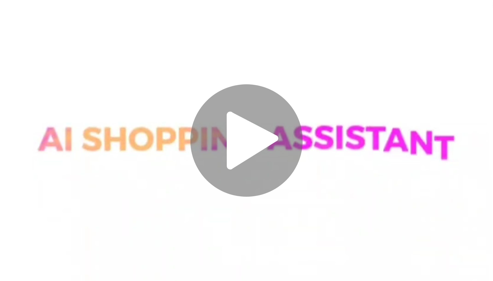

# Project Details

This project is an attempt at Theme-1 of the Appian AIgnite Hackathon, Round 3.  
It is an AI-Powered Personal Shopping Assistant for E-Commerce proof-of-concept on a footwear-only dataset.  

## Demo Trailer

# Setup Instructions

Please use a device running Windows

Clone this repository:
git clone https://github.com/Madhav-AK/AI-Shopping-Assistant/

Download the zip file in the following link (This is the dataset we trained on):
https://vision.cs.utexas.edu/projects/finegrained/utzap50k/ut-zap50k-images-square.zip

Extract it and place it inside the same working directory where you cloned our repository.
Create a copy of the extracted folder and place that copy in the same working directory.
Rename the copy to 'shoes'
If you did everything correctly, there should be 4 subfolders inside the 'ut-zap50k-images-square' folder with different kind of footwear, and a copy of that folder named 'shoes'

Run the python script shoes_init.py
(This converts the shoes folder into the format we need for the app to run)

Run the python script fakeStore/dataset.py

Create a .env file and paste the following contents into it:  
GEMINI_API_KEY=(insert your api key here)  
SECRET_KEY=1131714638dd80d57154725d8c317937  
DB_URI="sqlite:///test.db"  
EMAIL=xyz@gmail.com  
PASSWORD=xyz123  
STRIPE_PUBLIC=pk_test_51RXG0PP9PkOnkc6Midu0uHYeERlaUiKB7I6KMChkWVIVxa7NJHxfGHZxtkAQZKGN1lGeKEZLMoA0MOvMNHZhsKYv00jd6R3Gsw  
STRIPE_PRIVATE=sk_test_51RXG0PP9PkOnkc6MbJedioezSElNtO506u2rjg59THZ2ELn7bE6zvtcClfVjhJC53nyHZbPWuNqfrFOboFQW3Xvm00mQUOTLGu  
ENDPOINT_SECRET=whsec_fa6637cca291e72c147ed535145a36902ba61c0bb9bb65cc831fd332f579ed48  

Note that you can get a gemini api key for free at https://aistudio.google.com/app/apikey.  
If there is any issue with getting Gemini running, please contact the team.  
The other API keys are already directly given.  

Install all the dependencies in requirements.txt  

Run fakeStore/Flask-O-shop/app.py (This launches our backend website)  
Parallely run app.py (This launches our AI shopping assistant app)  
Ensure that both are running in parallelly on different terminals  
 
